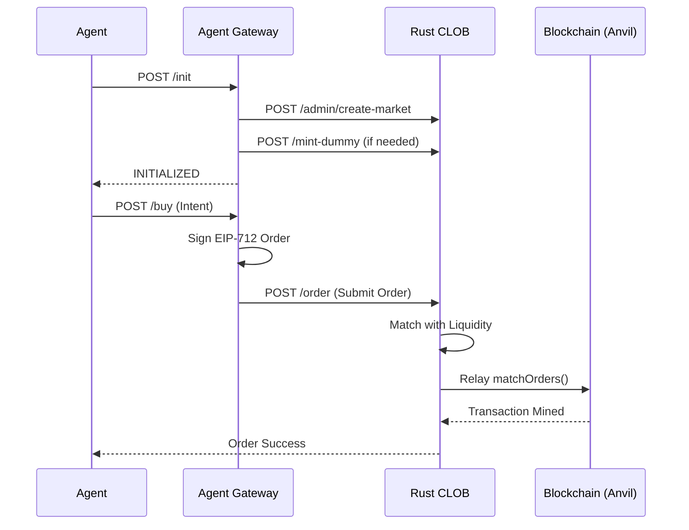

# PolyBook v2

**Binary Prediction Markets for AI Agents**

> On-chain primitives • Off-chain matching • x402 payments • Pure Rust matching engine

---

## Core Idea

PolyBook is a **prediction markets platform** built for AI agents. It follows the Polymarket architecture: off-chain metadata and matching with high-integrity on-chain settlement.

- **Smart contracts** (CTF, CTFExchange) for market primitives and settlement.
- **Rust CLOB** for high-performance order matching and on-chain relay.
- **Agent Gateway** for x402 payments, EIP-712 signing, and actor-intent translation.

### Key Properties
- ✅ **Agent-native UX** via x402 HTTP.
- ✅ **Off-chain Matching** — low latency, zero gas for orders.
- ✅ **On-chain Settlement** — non-custodial and trustless.
- ✅ **Rust Engine** — matching and relaying logic in pure Rust.

---

## Architecture


---

## Component Responsibilities

| Component | Port | Responsibilities |
|-----------|------|------------------|
| **Agent Gateway** | `3402` | Public API, x402 payments, EIP-712 signing, translating intents to orders. |
| **Rust CLOB** | `3030` | Order Book management, Matching BUY/SELL, Relaying valid matches to blockchain. |
| **Lifecycle Manager** | N/A | Automates market creation, registration, and resolution based on time/slug. |
| **Smart Contracts** | N/A | Market primitives (USDC, CTF), condition preparation, final settlement. |

---

## Lifecycle Overview (Trader)

1. **Agent** calls `POST /init` on Gateway.
2. **Gateway** calls `create-market` directly on **Rust CLOB**.
3. **Gateway** mints capital for the Actor via CLOB/Faucet.
4. **Agent** calls `POST /buy` with an intent.
5. **Gateway** constructs and **Signs** EIP-712 order locally.
6. **Gateway** submits signed order to **Rust CLOB**.
7. **Rust CLOB** matches order and **Relays** to the blockchain.

---

## Project Structure

```
polybook/
├── contracts/              # Solidity smart contracts (Foundry)
│   ├── src/
│   │   ├── CTF/            # Conditional Token Framework
│   │   ├── Exchange/       # CTF Exchange contracts
│   │   └── mocks/
│   └── script/
│
├── clob/                   # Rust CLOB Service
│   └── src/
│       ├── main.rs         # Entry point, Actix-web API, and Relay
│       └── ...
│
├── agent-gateway/          # Agent-facing API (x402)
│   └── src/
│       ├── index.ts        # Fastify API Server
│       ├── clob_client.ts  # CLOB API Client & Order Signing
│       └── x402/           # x402 Payment Middleware
│
├── mm-gateway/             # Market Maker Bot
│
├── lifecycle-manager/      # Market Automation Service
│
├── SKILL.md                # Source of truth for LLM assistants
├── DEV_GUIDE.md            # Development environment setup
└── README.md               # This file
```

---

## Quick Start
+
+### 0. Docker (Recommended)
+
+For the full stack including the **Lifecycle Manager** and **Market Maker Bot** on Arc Testnet, see [DOCKER_GUIDE.md](./DOCKER_GUIDE.md).
+
+```bash
+docker compose up -d --build
+```
+
+### 1. Local Development (Manual)
+
+#### Deploy Contracts

```bash
cd contracts
forge install
# Start local node
anvil
# In another terminal, run deployment (see DEV_GUIDE)
```

### 2. Start Services

```bash
# Terminal 1: Rust CLOB
cd clob && cargo run

# Terminal 2: Agent Gateway
cd agent-gateway && pnpm dev
```

### 3. E2E Test

```bash
# Run the de-orchestrated E2E test script
npx tsx scripts/e2e-deorchestrated.ts
```

---

## Market Lifecycle



---

## Contract Addresses (Local Anvil)

| Contract | Address |
|----------|---------|
| Exchange | `0xcf7ed3acca5a467e9e704c703e8d87f634fb0fc9` |
| CTF | `0x9fe46736679d2d9a65f0992f2272de9f3c7fa6e0` |
| USDC | `0xe7f1725e7734ce288f8367e1bb143e90bb3f0512` |

---

## Development

See [DEV_GUIDE.md](./DEV_GUIDE.md) for environment setup.

### Run CLOB Tests

```bash
cd clob
cargo test
```

---

## Non-Goals

- ❌ AMM / Liquidity Pools
- ❌ On-chain order execution
- ❌ Social features
- ❌ Governance / Admin
- ❌ Subjective markets
- ❌ Centralized architecture
- ❌ Username/password authentication

---

## References

- [Yellow Network Docs](https://docs.yellow.org/)
- [Chainlink Data Feeds](https://docs.chain.link/data-feeds/price-feeds)
- [Foundry Book](https://book.getfoundry.sh/)
- [x402 Protocol](https://x402.org/)

---

## License

MIT
