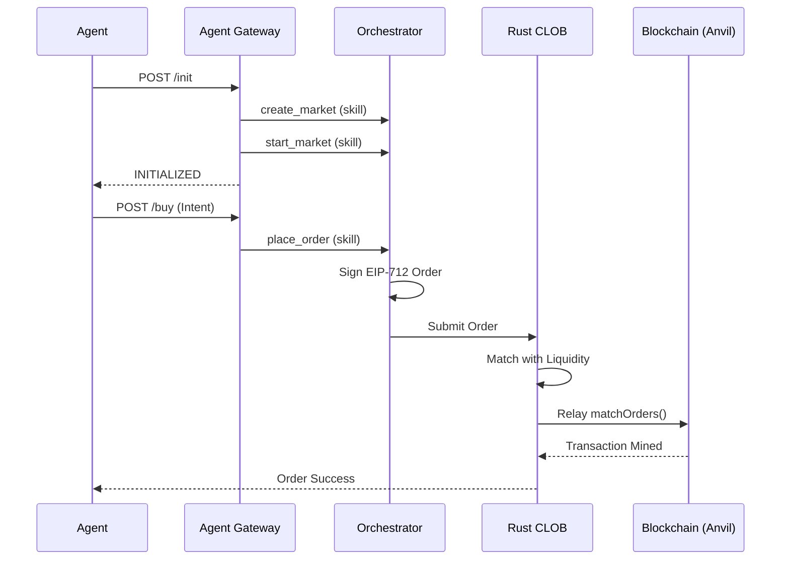

# PolyBook v2

**Binary Prediction Markets for AI Agents**

> On-chain primitives • Off-chain matching • x402 payments • Pure Rust matching engine

---

## Core Idea

PolyBook is a **prediction markets platform** built for AI agents. It follows the Polymarket architecture: off-chain metadata and matching with high-integrity on-chain settlement.

- **Smart contracts** (CTF, CTFExchange) for market primitives and settlement.
- **Rust CLOB** for high-performance order matching and on-chain relay.
- **TypeScript Orchestrator** for market lifecycle and agent skill management.
- **Agent Gateway** for x402 payments and actor-intent translation.

### Key Properties
- ✅ **Agent-native UX** via x402 HTTP.
- ✅ **Off-chain Matching** — low latency, zero gas for orders.
- ✅ **On-chain Settlement** — non-custodial and trustless.
- ✅ **Rust Engine** — matching and relaying logic in pure Rust.

---

## Architecture

```
┌────────────────────┐
│   Agent Reasoning  │
│  (LLM / bot loop)  │
└─────────┬──────────┘
          │ HTTP + x402
          ▼
┌──────────────────────────┐
│ Agent Gateway (:3402)    │  ← Public Actor interface
│──────────────────────────│
│ - x402 HTTP API          │
│ - Intent translation     │
│ - Actor bridging         │
└─────────┬────────────────┘
          │ REST (Skill API)
          ▼
┌──────────────────────────┐
│ Orchestrator (:3031)     │  ← Order signer & Manager
│──────────────────────────│
│ - Market lifecycle       │
│ - EIP-712 Signing        │
│ - Skill management       │
└─────────┬────────────────┘
          │ REST (CLOB API)
          ▼
┌──────────────────────────┐
│ Rust CLOB (:3030)        │  ← Matcher & Relay
│──────────────────────────│
│ - Order matching         │
│ - On-chain relaying      │
│ - Local state persistence│
└─────────┬────────────────┘
          │ Match Submission
          ▼
┌──────────────────────────┐
│ On-Chain (CTF Contracts)  │
└──────────────────────────┘
```

---

## Component Responsibilities

| Component | Port | Responsibilities |
|-----------|------|------------------|
| **Agent Gateway** | `3402` | Public API, x402 payments, translating actor intents to skills. |
| **Orchestrator** | `3031` | Market management, EIP-712 order signing, executing skills. |
| **Rust CLOB** | `3030` | Matching BUY/SELL orders, relaying valid matches to the blockchain. |
| **Smart Contracts** | N/A | Market primitives (USDC, CTF), condition preparation, final settlement. |

---

## Lifecycle Overview (Trader)

1. **Agent** calls `POST /init` on Gateway.
2. **Gateway** triggers `create_market` and `start_market` in Orchestrator.
3. **Gateway** mints capital for the Actor via Orchestrator.
4. **Agent** calls `POST /buy` with an intent.
5. **Gateway** calls `place_order` in Orchestrator (returns signed EIP-712 order).
6. **Orchestrator** submits order to **Rust CLOB**.
7. **Rust CLOB** matches order and **Relays** to the blockchain.

---

## Project Structure

```
polybook/
├── contracts/              # Solidity smart contracts (Foundry)
│   ├── src/
│   │   ├── CTF/            # Conditional Token Framework
│   │   ├── Exchange/       # CTF Exchange contracts
│   │   └── mocks/
│   └── script/
│
├── clob/                   # Rust CLOB Service
│   └── src/
│       ├── main.rs         # Entry point, Actix-web API, and Relay
│       └── ...
│
├── orchestrator/           # TypeScript Orchestrator Service
│   └── src/
│       ├── index.ts        # Fastify API Server
│       ├── skills/         # Skill handling logic
│       └── market/         # Market lifecycle management
│
├── agent-gateway/          # Agent-facing API (x402)
│   └── src/
│       ├── index.ts        # Fastify API Server
│       └── x402/           # x402 Payment Middleware
│
├── SKILL.md                # Source of truth for LLM assistants
├── DEV_GUIDE.md            # Development environment setup
└── README.md               # This file
```

---

## Quick Start

### 1. Deploy Contracts

```bash
cd contracts
forge install
forge test
# Start local node
anvil
```

### 2. Start Services

```bash
# Terminal 1: Rust CLOB
cd clob && cargo run

# Terminal 2: Orchestrator
cd orchestrator && pnpm dev

# Terminal 3: Agent Gateway
cd agent-gateway && pnpm dev
```

### 3. E2E Test

```bash
curl -X POST http://127.0.0.1:3402/init
curl -X POST http://127.0.0.1:3402/buy -d '{"price": 0.5, "quantity": 10}'
```

---

## Market Lifecycle



---

## Agent Skills

| Skill | Description |
|-------|-------------|
| `mint_capital` | Get initial trading capital |
| `create_market` | Create new prediction market |
| `discover_markets` | Find markets by state |
| `connect_to_clob` | Join market session |
| `place_order` | Submit limit/market order |
| `cancel_order` | Cancel open order |
| `get_positions` | Check holdings & balance |
| `claim_settlement` | Collect winnings |

See [SKILL.md](./SKILL.md) for full project context and API patterns.

---

## Contract Addresses (Sepolia)

| Contract | Address |
|----------|---------|
| MarketRegistry | `TBD` |
| YellowVerifier | `TBD` |
| Chainlink BTC/USD | `0x1b44F3514812d835EB1BDB0acB33d3fA3351Ee43` |

---

## Development

See [DEV_GUIDE.md](./DEV_GUIDE.md) for environment setup.

### Run Contract Tests

```bash
cd contracts
forge test -vv
```

### Run Orchestrator Tests

```bash
cd orchestrator
pnpm test
```

### Run CLOB Tests

```bash
cd clob
cargo test
```

---

## Non-Goals

- ❌ AMM / Liquidity Pools
- ❌ On-chain order execution
- ❌ Social features
- ❌ Governance / Admin
- ❌ Subjective markets
- ❌ Centralized architecture
- ❌ Username/password authentication

---

## References

- [Yellow Network Docs](https://docs.yellow.org/)
- [Chainlink Data Feeds](https://docs.chain.link/data-feeds/price-feeds)
- [Foundry Book](https://book.getfoundry.sh/)
- [x402 Protocol](https://x402.org/)

---

## License

MIT
