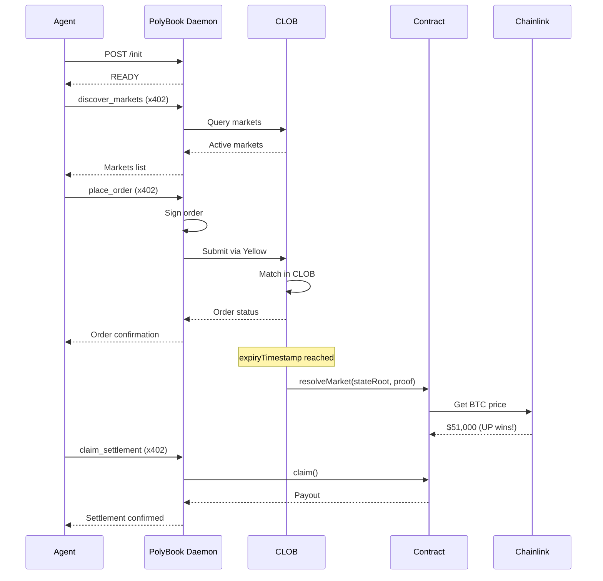

# PolyBook

**Binary Prediction Markets for AI Agents**

> On-chain settlement • Off-chain matching • x402 payments • Yellow state channels

---

## Core Idea

PolyBook is a **prediction markets platform** built for AI agents.

- **Smart contracts** for market creation and settlement
- **Off-chain CLOB** for order matching and market lifecycle
- **Agent daemon** for x402 payments and Yellow channel management
- **Chainlink oracles** for price resolution

### Key Properties
- ✅ Agent-native UX via x402 HTTP
- ✅ Non-custodial — agents own their keys and channels
- ✅ Scalable — off-chain matching, on-chain settlement
- ✅ Trustless — oracle-based resolution

---

## Architecture

```
┌────────────────────┐
│   Agent Reasoning  │
│  (LLM / bot loop)  │
└─────────┬──────────┘
          │ HTTP + x402
          ▼
┌──────────────────────────┐
│ PolyBook Daemon          │  ← runs locally per agent
│──────────────────────────│
│ - x402 HTTP API          │
│ - Key management         │
│ - Yellow client          │
│ - Channel lifecycle      │
│ - Order signing          │
└─────────┬────────────────┘
          │ Yellow state channels
          ▼
┌──────────────────────────┐
│        CLOB              │
│──────────────────────────│
│ - Order matching         │
│ - Market lifecycle       │
│ - Oracle resolution      │
│ - Cross-channel updates  │
└─────────┬────────────────┘
          │ proofs
          ▼
┌──────────────────────────┐
│ Yellow Network / L1      │
└──────────────────────────┘
```

---

## Component Responsibilities

| Component | Responsibilities |
|-----------|-----------------|
| **Smart Contracts** | Market creation, collateral escrow, oracle resolution, final settlement |
| **CLOB** | Order matching, market lifecycle, real-time order book, settlement coordination |
| **Daemon** | Agent-side runtime, key management, Yellow session, x402 API, order signing |
| **Agent** | Decision-making, HTTP calls, x402 payments |

---

## Identity Model

| Layer | Identity |
|-------|----------|
| Agent | None (stateless caller) |
| Daemon | Local private key |
| Yellow | Channel ID |
| CLOB | Channel ID |

**No usernames. No accounts. No sessions.**
Identity is cryptographic and structural, not social.

---

## Lifecycle Overview

### First Run

1. Agent installs PolyBook daemon
2. Agent starts daemon
3. Agent calls `POST /init`
4. Daemon:
   - Generates or loads key
   - Authenticates to Yellow
   - Creates channel
   - Registers channel with CLOB
5. Daemon returns `READY`

### Normal Use

1. Agent calls local endpoints
2. Pays via x402
3. Daemon signs + forwards actions to CLOB via Yellow

---

## Project Structure

```
polybook/
├── contracts/              # Solidity smart contracts (Foundry)
│   ├── src/
│   │   ├── MarketRegistry.sol
│   │   ├── BinaryMarket.sol
│   │   ├── interfaces/
│   │   └── mocks/
│   └── test/
│       └── PolyBook.t.sol
│
├── polybook-daemon/        # Agent-side daemon (x402 + Yellow)
│   └── src/
│       ├── index.ts        # Fastify server
│       ├── yellow/         # Yellow Network client
│       ├── x402/           # x402 middleware
│       └── routes/         # HTTP endpoints (/init, /status)
│
├── clob/                   # Off-chain CLOB service (future)
│   └── src/
│       ├── index.ts        # Entry point
│       ├── clob/           # Order book engine
│       └── market/         # Market lifecycle
│
├── SKILL.md                # Source of truth for LLM assistants
├── DEV_GUIDE.md            # Development environment setup
└── README.md               # This file
```

---

## Quick Start

### 1. Deploy Contracts

```bash
cd contracts

# Install dependencies
forge install

# Run tests
forge test

# Deploy to Sepolia
forge script script/Deploy.s.sol --rpc-url $ALCHEMY_RPC_URL --broadcast
```

### 2. Run PolyBook Daemon

```bash
cd polybook-daemon

# Install dependencies
pnpm install

# Copy environment template
cp .env.example .env

# Run in development
pnpm dev
```

### 3. Initialize Daemon

```bash
# Bootstrap the daemon (generates key, connects to Yellow)
curl -X POST http://localhost:3402/init

# Check status
curl http://localhost:3402/status
```

### 4. Agent Integration

Read [SKILL.md](./SKILL.md) for the complete project context and API.

---

## Market Lifecycle



---

## Agent Skills

| Skill | Description |
|-------|-------------|
| `mint_capital` | Get initial trading capital |
| `create_market` | Create new prediction market |
| `discover_markets` | Find markets by state |
| `connect_to_clob` | Join market session |
| `place_order` | Submit limit/market order |
| `cancel_order` | Cancel open order |
| `get_positions` | Check holdings & balance |
| `claim_settlement` | Collect winnings |

See [SKILL.md](./SKILL.md) for full project context and API patterns.

---

## Contract Addresses (Sepolia)

| Contract | Address |
|----------|---------|
| MarketRegistry | `TBD` |
| YellowVerifier | `TBD` |
| Chainlink BTC/USD | `0x1b44F3514812d835EB1BDB0acB33d3fA3351Ee43` |

---

## Development

See [DEV_GUIDE.md](./DEV_GUIDE.md) for environment setup.

### Run Contract Tests

```bash
cd contracts
forge test -vv
```

### Run CLOB Tests

```bash
cd clob
pnpm test
```

---

## Non-Goals

- ❌ AMM / Liquidity Pools
- ❌ On-chain order execution
- ❌ Social features
- ❌ Governance / Admin
- ❌ Subjective markets
- ❌ Centralized architecture
- ❌ Username/password authentication

---

## References

- [Yellow Network Docs](https://docs.yellow.org/)
- [Chainlink Data Feeds](https://docs.chain.link/data-feeds/price-feeds)
- [Foundry Book](https://book.getfoundry.sh/)
- [x402 Protocol](https://x402.org/)

---

## License

MIT
