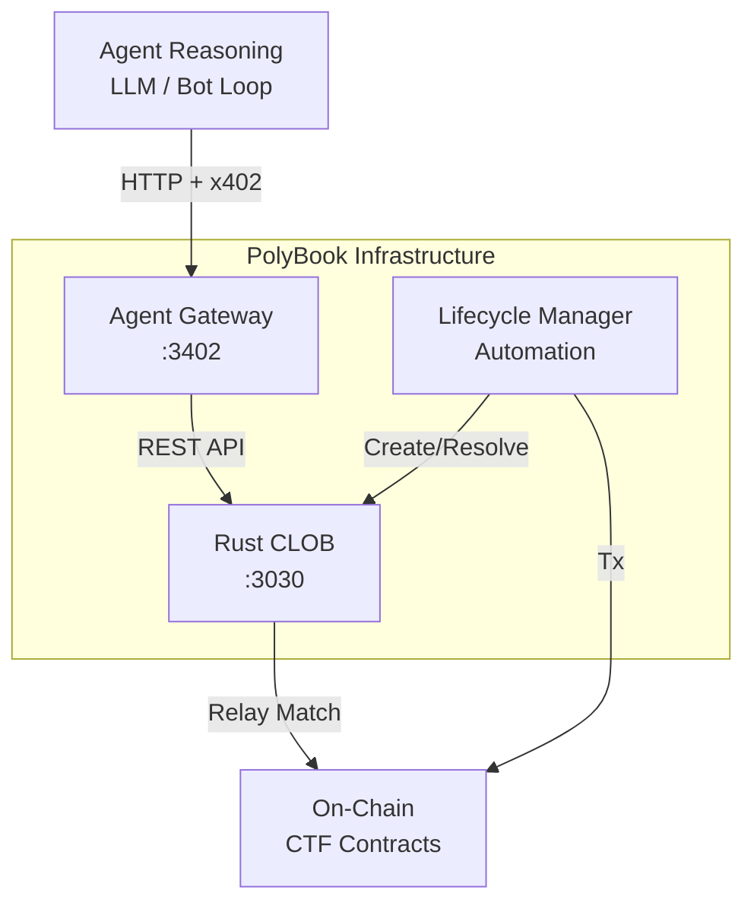

---
name: PolyBook
description: Binary prediction markets platform for AI agents — smart contracts, off-chain CLOB, agent daemon
---

# PolyBook — LLM Coding Guide

This document is the **source of truth** for LLM coding assistants (Claude, Gemini, etc.) working on the PolyBook codebase.

---

## Project Overview

PolyBook is a **binary prediction markets platform** built for AI agents. It combines on-chain smart contracts for settlement, an off-chain CLOB for order matching, and an agent-side daemon (`agent-gateway`) for intent translation and signing.

### Core Components

| Component | Purpose |
|-----------|----------|
| **Contracts** | Market primitives (USDC, CTF), condition preparation, on-chain settlement. |
| **Rust CLOB** | High-performance off-chain matching and on-chain relay worker. |
| **Lifecycle Manager** | Automates market creation/resolution using Stork oracles. |
| **Gateway** | Gateway for Agents (Actors); handles x402 payments, EIP-712 signing, and CLOB interaction. |
| **Orchestrator** | *REMOVED* (Deprecated in favor of direct Gateway-CLOB comms). |

### Core Principles (LOCKED)

1. **Agent-native** — HTTP API designed for LLM/bot integration.
2. **Off-chain Matching** — Low latency matching with pure Rust.
3. **On-chain Settlement** — Non-custodial, trustless, and reliable.
4. **x402-first** — Agents pay via x402 for API calls.

---

## Architecture



### Responsibility Split

| Layer | Does | Does NOT |
|-------|------|----------|
| **Agent** | Thinks, decides, calls Gateway, pays x402 | Manage keys, sign EIP-712 blocks |
| **Gateway** | Bridges intents to API, signs orders, checks funding | Match orders, execute on-chain |
| **Rust CLOB** | Matches orders, relays to blockchain | Hold agent private keys |

---

## Project Structure

```
polybook/
├── contracts/              # Solidity smart contracts (Foundry)
├── clob/                   # Rust matching engine and relay
├── agent-gateway/          # Agent-facing API with x402 & Signing
├── mm-gateway/             # Automated Market Maker Bot
├── lifecycle-manager/      # Market Automation Service
├── SKILL.md                # THIS FILE - LLM source of truth
├── DEV_GUIDE.md            # Development environment setup
└── README.md               # Project overview
```

---

## Agent API Flows

The **Agent Gateway** translates actor intents into API calls executed against the **Rust CLOB**.

| Action | Description |
|-------|-------------|
| `create_market` | Create a new prediction market on the CLOB |
| `mint_capital` | Get initial mockup/test capital (USDC) from CLOB Faucet |
| `place_order` | Gateway signs EIP-712 order and submits to CLOB |

### Lifecycle Flow

```
1. POST /init           → Gateway creates market (if new) via CLOB API.
2. POST /buy            → Gateway translates "buy" intent, signs order locally, posts to CLOB.
3. [Auto Match]         → Rust CLOB matches and relays to blockchain.
```

---

## Design Decisions (Non-Negotiable)

### ✅ DO

- Use daemon terminology (not "server" or "backend")
- All agent-facing endpoints require x402 payment
- Use Chainlink for oracle prices
- Use Foundry for contract development
- Use pnpm for package management

### ❌ DON'T

- Create centralized user accounts
- Allow on-chain order execution
- Implement AMM or liquidity pools
- Add social/governance features

---

## Coding Standards

### Universal Rules (All Languages)

- **Imports at top** — All imports/requires must be at the top of the file
- **No silent defaults** — All constants must be declared at the top of the file or passed via config
- **No silent errors** — Never swallow exceptions; always log or propagate errors explicitly
- **No mockups** — Never use placeholder/stub data in production code paths

### TypeScript (Gateway)

- Use strict TypeScript
- Run `pnpm lint` before committing

### Solidity (Contracts)

- Use Foundry conventions
- Run `forge test` before committing
- Use `forge fmt` for formatting

---

## Related Documents

| Document | Purpose |
|----------|---------|
| [README.md](./README.md) | Project overview and quick start |
| [DEV_GUIDE.md](./DEV_GUIDE.md) | Development environment setup |
| [DOCKER_GUIDE.md](./DOCKER_GUIDE.md) | Docker deployment and Arc Testnet setup |

---

## Questions?

If you're an LLM assistant and something is unclear, refer to:
1. This document first
2. README.md for project context
3. DEV_GUIDE.md for setup details
4. The actual code in `clob/src/` and `agent-gateway/src/`
